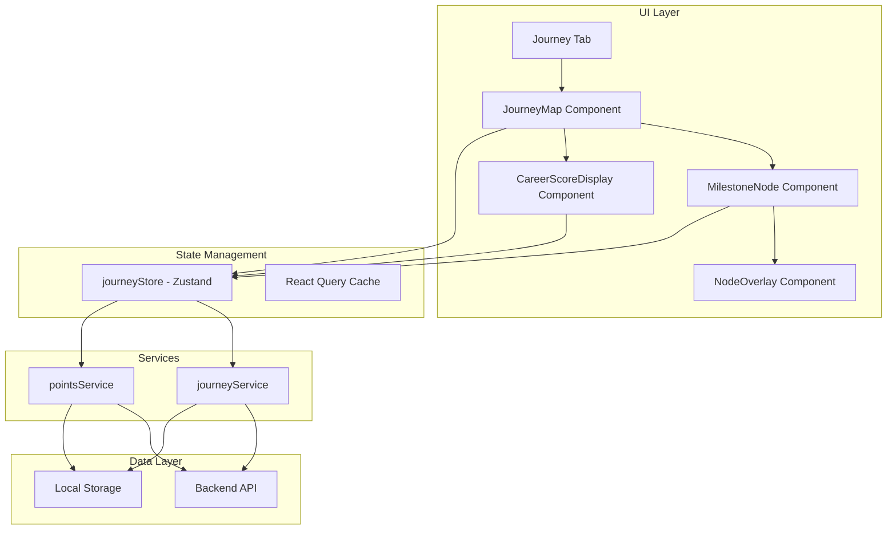

# Design Document: Career Journey (Forest Map)

## Overview

The Career Journey feature provides a calm, narrative-driven visualization of a user's job search progression. Built as a signed-in-only feature, it renders a vertically scrollable forest-style map where users progress from bottom to top. Each accepted job marks the completion of a "Level" (career chapter), while milestone nodes represent key achievements along the path.

The design prioritizes a reflective, journal-like experience over gamification. Visual progression rewards come through subtle environmental changes rather than badges or competitive elements.

## Architecture



## Components and Interfaces

### Journey Tab Integration

The Journey tab will be added to the existing tab navigation, conditionally rendered based on authentication state.

```typescript
// types/journey.ts
export interface JourneyLevel {
  id: string;
  levelNumber: number;
  title: string;
  startedAt: Date;
  completedAt?: Date;
  acceptedJobId?: string;
}

export interface Milestone {
  id: string;
  type: MilestoneType;
  title: string;
  description: string;
  threshold: number;
  unlockedAt?: Date;
  reflection?: string;
}

export type MilestoneType = 
  | 'first_application'
  | 'applications_10'
  | 'applications_25'
  | 'applications_50'
  | 'first_interview'
  | 'first_offer'
  | 'accepted_offer';

export type MilestoneState = 'locked' | 'unlocked' | 'current';

export interface JourneyState {
  currentLevel: JourneyLevel;
  completedLevels: JourneyLevel[];
  milestones: Milestone[];
  careerScore: number;
  visualTier: VisualTier;
}

export type VisualTier = 'seedling' | 'sapling' | 'grove' | 'forest';

export interface PointAction {
  type: 'job_added' | 'task_completed' | 'habit_completed';
  points: number;
  timestamp: Date;
}
```

### JourneyMap Component

```typescript
// components/journey/JourneyMap.tsx
interface JourneyMapProps {
  journeyState: JourneyState;
  onMilestonePress: (milestone: Milestone) => void;
}

// Renders the vertically scrollable forest path
// Handles scroll position to show current progress
// Applies visual tier theming
```

### MilestoneNode Component

```typescript
// components/journey/MilestoneNode.tsx
interface MilestoneNodeProps {
  milestone: Milestone;
  state: MilestoneState;
  onPress: () => void;
}

// Renders individual milestone markers on the path
// Handles locked/unlocked/current visual states
// Triggers unlock animations when state changes
```

### NodeOverlay Component

```typescript
// components/journey/NodeOverlay.tsx
interface NodeOverlayProps {
  milestone: Milestone;
  visible: boolean;
  onClose: () => void;
  onReflectionSave: (text: string) => void;
}

// Modal overlay showing milestone details
// Includes optional reflection text input
// Displays achievement date and statistics
```

### CareerScoreDisplay Component

```typescript
// components/journey/CareerScoreDisplay.tsx
interface CareerScoreDisplayProps {
  score: number;
  visualTier: VisualTier;
}

// Subtle score display in journey header
// Uses reflective language ("Your Journey: X points")
```

### Journey Service

```typescript
// features/journey/services/journeyService.ts
interface JourneyService {
  getJourneyState(): Promise<JourneyState>;
  completeLevel(acceptedJobId: string): Promise<JourneyLevel>;
  unlockMilestone(milestoneId: string): Promise<Milestone>;
  saveReflection(milestoneId: string, text: string): Promise<void>;
  syncJourneyState(state: JourneyState): Promise<void>;
}
```

### Points Service

```typescript
// features/journey/services/pointsService.ts
interface PointsService {
  awardPoints(action: PointAction): Promise<number>;
  getCareerScore(): Promise<number>;
  getPointHistory(): Promise<PointAction[]>;
}

// Point values
const POINT_VALUES = {
  job_added: 10,
  task_completed: 5,
  habit_completed: 5,
} as const;
```

### Journey Store (Zustand)

```typescript
// store/journeyStore.ts
interface JourneyStore {
  // State
  journeyState: JourneyState | null;
  isLoading: boolean;
  pendingUpdates: JourneyUpdate[];
  
  // Actions
  loadJourneyState: () => Promise<void>;
  awardPoints: (action: PointAction) => void;
  completeLevel: (jobId: string) => void;
  saveReflection: (milestoneId: string, text: string) => void;
  syncPendingUpdates: () => Promise<void>;
}
```

## Data Models

### Journey State Schema

```typescript
// Persisted journey data structure
interface PersistedJourneyState {
  userId: string;
  currentLevelId: string;
  careerScore: number;
  levels: JourneyLevel[];
  milestones: MilestoneRecord[];
  lastSyncedAt: Date;
}

interface MilestoneRecord {
  milestoneType: MilestoneType;
  unlockedAt?: Date;
  reflection?: string;
}
```

### Milestone Configuration

```typescript
const MILESTONE_CONFIG: Record<MilestoneType, MilestoneDefinition> = {
  first_application: {
    title: 'First Step',
    description: 'Added your first job application',
    threshold: 1,
    checkFn: (stats) => stats.totalApplications >= 1,
  },
  applications_10: {
    title: 'Building Momentum',
    description: 'Reached 10 job applications',
    threshold: 10,
    checkFn: (stats) => stats.totalApplications >= 10,
  },
  applications_25: {
    title: 'Steady Progress',
    description: 'Reached 25 job applications',
    threshold: 25,
    checkFn: (stats) => stats.totalApplications >= 25,
  },
  applications_50: {
    title: 'Dedicated Seeker',
    description: 'Reached 50 job applications',
    threshold: 50,
    checkFn: (stats) => stats.totalApplications >= 50,
  },
  first_interview: {
    title: 'Making Connections',
    description: 'Reached your first interview',
    threshold: 1,
    checkFn: (stats) => stats.totalInterviews >= 1,
  },
  first_offer: {
    title: 'Recognition',
    description: 'Received your first job offer',
    threshold: 1,
    checkFn: (stats) => stats.totalOffers >= 1,
  },
  accepted_offer: {
    title: 'New Chapter',
    description: 'Accepted a job offer',
    threshold: 1,
    checkFn: (stats) => stats.acceptedJobs >= 1,
  },
};
```

### Visual Tier Thresholds

```typescript
const VISUAL_TIER_THRESHOLDS: Record<VisualTier, number> = {
  seedling: 0,      // Starting state
  sapling: 100,     // ~10 jobs or 20 tasks/habits
  grove: 500,       // Sustained engagement
  forest: 1500,     // Long-term dedication
};

function getVisualTier(score: number): VisualTier {
  if (score >= 1500) return 'forest';
  if (score >= 500) return 'grove';
  if (score >= 100) return 'sapling';
  return 'seedling';
}
```

## Correctness Properties

*A property is a characteristic or behavior that should hold true across all valid executions of a system—essentially, a formal statement about what the system should do. Properties serve as the bridge between human-readable specifications and machine-verifiable correctness guarantees.*

### Property 1: Tab Visibility Matches Authentication State

*For any* authentication state (authenticated or not), the Journey tab visibility SHALL equal the authentication status—visible when authenticated, hidden when not.

**Validates: Requirements 1.1, 1.2**

### Property 2: New User Level Initialization

*For any* newly created journey state, the current level SHALL be Level 0 with title "Job Hunt" and no completion date.

**Validates: Requirements 3.1**

### Property 3: Level Increment on Job Acceptance

*For any* user at level N who accepts a job offer, the resulting level number SHALL be exactly N + 1.

**Validates: Requirements 3.2, 3.3**

### Property 4: Completed Levels Persistence

*For any* sequence of level completions, all previously completed levels SHALL remain in the completedLevels array—the array length never decreases.

**Validates: Requirements 3.4**

### Property 5: Completed Level Data Integrity

*For any* completed level in the journey state, it SHALL have both a non-empty title and a valid completedAt date.

**Validates: Requirements 3.6**

### Property 6: Milestone Lock State Correctness

*For any* milestone with threshold T and user activity count C, the milestone SHALL be locked if and only if C < T.

**Validates: Requirements 4.2**

### Property 7: Milestone State Validity

*For any* milestone, its computed state SHALL be exactly one of: 'locked', 'unlocked', or 'current'.

**Validates: Requirements 4.5**

### Property 8: Unlocked Milestone Overlay Data Completeness

*For any* unlocked milestone, its overlay data SHALL contain: a non-empty title, a valid unlockedAt date, and relevant statistics object.

**Validates: Requirements 5.2**

### Property 9: Locked Milestone Hint Availability

*For any* locked milestone, there SHALL exist a non-empty hint string describing how to unlock it.

**Validates: Requirements 5.5**

### Property 10: Point Award Action Validation

*For any* point award request, points SHALL only be awarded if the action type is one of: 'job_added', 'task_completed', or 'habit_completed'.

**Validates: Requirements 6.1**

### Property 11: Career Score Monotonicity

*For any* sequence of point-earning actions, the career score SHALL be monotonically non-decreasing and equal to the sum of all awarded points.

**Validates: Requirements 6.2, 6.4**

### Property 12: Visual Tier Threshold Correctness

*For any* career score S, the computed visual tier SHALL match the highest threshold T where S >= T.

**Validates: Requirements 7.1**

### Property 13: Journey State Round-Trip Serialization

*For any* valid JourneyState object, serializing to JSON then deserializing SHALL produce an equivalent object.

**Validates: Requirements 8.1, 8.2**

### Property 14: Offline Update Queuing

*For any* journey update made while offline, the update SHALL be added to the pendingUpdates queue and the queue length SHALL increase by 1.

**Validates: Requirements 8.4**

## Error Handling

### Network Errors

- Journey state loads from local cache if network unavailable
- Updates queue locally and sync when connectivity returns
- User sees subtle offline indicator, not error messages

### Invalid State Recovery

- If journey state is corrupted, reinitialize from user's job history
- Recalculate milestones based on actual job/task/habit counts
- Log recovery events for debugging

### Authentication Errors

- If auth token expires while viewing Journey, redirect to sign-in
- Preserve any pending updates in local storage
- Resume sync after re-authentication

## Testing Strategy

### Unit Tests

Unit tests verify specific examples and edge cases:

- Initial journey state creation for new users
- Level completion with specific job data
- Milestone unlock at exact threshold boundaries
- Point calculation for each action type
- Visual tier transitions at threshold boundaries

### Property-Based Tests

Property-based tests verify universal properties across all inputs using fast-check:

- Each property test runs minimum 100 iterations
- Tests generate random journey states, action sequences, and user data
- Tag format: **Feature: career-journey, Property {number}: {property_text}**

Test configuration:
```typescript
// vitest.config.ts or jest.config.js
// Property tests use fast-check library
// Minimum 100 iterations per property
```

### Integration Tests

- Journey tab visibility with auth state changes
- End-to-end level completion flow
- Offline/online sync behavior
- Cross-device state restoration
