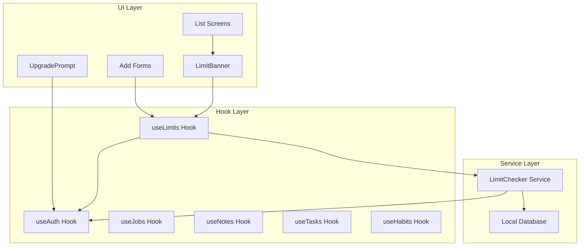

# Design Document: Free Tier Limits

## Overview

This design implements a freemium model for the Job Application Tracker mobile app. Users who continue without signing in (Free Tier) have limited capacity for creating items, while authenticated users (Premium Tier) get unlimited access. The implementation uses a centralized limit checking service, reusable UI components for limit banners and upgrade prompts, and integrates seamlessly with the existing auth-aware data hooks.

## Architecture



## Components and Interfaces

### 1. Limit Configuration

```typescript
// config/limits.ts

export interface EntityLimits {
  jobs: number;
  notes: number;
  tasks: number;
  habits: number;
}

export const FREE_TIER_LIMITS: EntityLimits = {
  jobs: 10,
  notes: 5,
  tasks: 10,
  habits: 3,
};

export type EntityType = keyof EntityLimits;
```

### 2. Limit Checker Service

```typescript
// services/limits/limitChecker.ts

export interface LimitStatus {
  currentCount: number;
  maxLimit: number;
  canCreate: boolean;
  usagePercentage: number;
  isAtLimit: boolean;
}

export interface LimitCheckerResult {
  getStatus: (entityType: EntityType) => Promise<LimitStatus>;
  canCreate: (entityType: EntityType) => Promise<boolean>;
}
```

### 3. useLimits Hook

```typescript
// hooks/useLimits.ts

export interface UseLimitsReturn {
  /** Check if user can create a new item */
  canCreate: boolean;
  /** Current count of items */
  currentCount: number;
  /** Maximum allowed items (Infinity for premium) */
  maxLimit: number;
  /** Usage as percentage (0-100) */
  usagePercentage: number;
  /** Whether user is at the limit */
  isAtLimit: boolean;
  /** Whether user is in free tier */
  isFreeTier: boolean;
  /** Loading state */
  isLoading: boolean;
  /** Refresh limit status */
  refresh: () => void;
}

export function useLimits(entityType: EntityType): UseLimitsReturn;
```

### 4. LimitBanner Component

```typescript
// components/ui/LimitBanner.tsx

export interface LimitBannerProps {
  entityType: EntityType;
  entityLabel: string; // e.g., "jobs", "notes"
  onUpgradePress?: () => void;
}

// Color scheme based on usage:
// - Below 70%: neutral (gray)
// - 70-99%: warning (amber)
// - 100%: alert (red)
```

### 5. UpgradePrompt Component

```typescript
// components/ui/UpgradePrompt.tsx

export interface UpgradePromptProps {
  visible: boolean;
  onDismiss: () => void;
  onSignIn: () => void;
  entityType?: EntityType; // For contextual messaging
}

// Benefits to display:
// - Unlimited jobs, notes, tasks, and habits
// - Cloud sync across devices
// - Never lose your data
```

## Data Models

No new data models required. The feature uses existing entity counts from the local database and authentication state from useAuth.

## Correctness Properties

*A property is a characteristic or behavior that should hold true across all valid executions of a system—essentially, a formal statement about what the system should do. Properties serve as the bridge between human-readable specifications and machine-verifiable correctness guarantees.*

### Property 1: Free Tier Limit Enforcement

*For any* entity type (jobs, notes, tasks, habits) and *for any* Free Tier user, the limit checker SHALL return `canCreate: false` when the current count equals or exceeds the configured maximum limit for that entity type.

**Validates: Requirements 1.1, 1.4, 2.1, 2.4, 3.1, 3.4, 4.1, 4.4**

### Property 2: Premium Tier Unlimited Access

*For any* entity type and *for any* Premium Tier user (authenticated), the limit checker SHALL return `canCreate: true` regardless of the current count.

**Validates: Requirements 1.5, 2.5, 3.5, 4.5**

### Property 3: Usage Percentage Calculation

*For any* current count and maximum limit where limit > 0, the usage percentage SHALL equal `Math.round((currentCount / maxLimit) * 100)` clamped between 0 and 100.

**Validates: Requirements 6.1, 7.2**

### Property 4: Color Scheme Selection

*For any* usage percentage:
- If percentage < 70, the color scheme SHALL be 'neutral'
- If percentage >= 70 AND percentage < 100, the color scheme SHALL be 'warning'
- If percentage >= 100, the color scheme SHALL be 'alert'

**Validates: Requirements 6.2, 6.3, 6.4**

### Property 5: Banner Visibility by Tier

*For any* screen displaying a limit banner, the banner SHALL be visible if and only if the user is in Free Tier mode.

**Validates: Requirements 6.6**

### Property 6: Limit Status Consistency

*For any* entity type, the `isAtLimit` property SHALL be true if and only if `currentCount >= maxLimit` for Free Tier users, and SHALL always be false for Premium Tier users.

**Validates: Requirements 1.2, 2.2, 3.2, 4.2, 7.2, 7.3**

## Error Handling

| Scenario | Handling |
|----------|----------|
| Database query fails | Return conservative limit (assume at limit) and log error |
| Auth state undefined | Treat as Free Tier until auth state resolves |
| Invalid entity type | Throw error in development, return unlimited in production |

## Testing Strategy

### Unit Tests
- Test limit configuration values are correct
- Test color scheme selection function with boundary values (69%, 70%, 99%, 100%)
- Test usage percentage calculation with edge cases (0 items, at limit, over limit)

### Property-Based Tests
- **Property 1**: Generate random entity types and counts, verify limit enforcement for Free Tier
- **Property 2**: Generate random entity types and counts, verify no limits for Premium Tier
- **Property 3**: Generate random count/limit pairs, verify percentage calculation
- **Property 4**: Generate random percentages, verify correct color scheme
- **Property 5**: Generate random tier states, verify banner visibility
- **Property 6**: Generate random states, verify isAtLimit consistency

### Integration Tests
- Test useLimits hook with mocked auth and database
- Test LimitBanner renders correct state based on useLimits
- Test UpgradePrompt triggers sign-in flow correctly

### Property-Based Testing Configuration
- Library: fast-check (already used in project or install if needed)
- Minimum iterations: 100 per property
- Tag format: **Feature: free-tier-limits, Property {number}: {property_text}**
