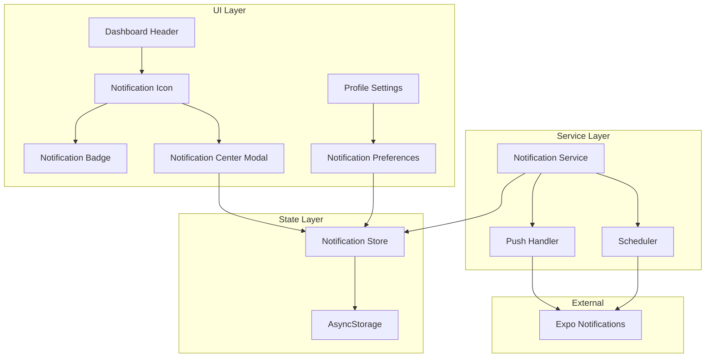

# Design Document: Notification Service

## Overview

This design document outlines the architecture and implementation details for a comprehensive notification service in the Turtle mobile application. The system provides both in-app and push notifications for job search activities, with user-configurable preferences accessible from the profile screen.

The notification service follows a modular architecture with clear separation between:
- **Notification Store**: State management and persistence (Zustand)
- **Notification Service**: Core logic for creating, scheduling, and delivering notifications
- **UI Components**: Notification icon, badge, center, and preference toggles

## Architecture



## Components and Interfaces

### 1. Notification Types

```typescript
// types/notifications.ts

export enum NotificationType {
  JOB_STATUS_CHANGE = 'job_status_change',
  HABIT_REMINDER = 'habit_reminder',
  TASK_DUE = 'task_due',
  TASK_OVERDUE = 'task_overdue',
  GOAL_ACHIEVEMENT = 'goal_achievement',
  DAILY_SUMMARY = 'daily_summary',
}

export interface Notification {
  id: string;
  type: NotificationType;
  title: string;
  body: string;
  timestamp: Date;
  read: boolean;
  data?: {
    targetType?: 'job' | 'habit' | 'task' | 'note';
    targetId?: string;
    [key: string]: unknown;
  };
}

export interface NotificationPreferences {
  enabled: boolean; // Master toggle
  jobStatusChanges: boolean;
  habitReminders: boolean;
  taskDueReminders: boolean;
  goalAchievements: boolean;
  dailySummary: boolean;
  habitReminderTime: string; // HH:mm format, default "09:00"
}

export interface NotificationCreateInput {
  type: NotificationType;
  title: string;
  body: string;
  data?: Notification['data'];
}
```

### 2. Notification Store Interface

```typescript
// store/notificationStore.ts

interface NotificationState {
  // State
  notifications: Notification[];
  preferences: NotificationPreferences;
  unreadCount: number;
  
  // Actions
  addNotification: (input: NotificationCreateInput) => void;
  markAsRead: (id: string) => void;
  markAllAsRead: () => void;
  deleteNotification: (id: string) => void;
  clearAllNotifications: () => void;
  updatePreferences: (prefs: Partial<NotificationPreferences>) => void;
  
  // Computed
  getUnreadCount: () => number;
}
```

### 3. Notification Service Interface

```typescript
// services/notifications/notificationService.ts

interface NotificationService {
  // Initialization
  initialize: () => Promise<void>;
  requestPermissions: () => Promise<boolean>;
  
  // Notification Creation
  createJobStatusNotification: (job: Job, newStatus: JobStatus) => void;
  createHabitReminderNotification: (habit: Habit) => void;
  createTaskDueNotification: (task: Task) => void;
  createTaskOverdueNotification: (task: Task) => void;
  createGoalAchievementNotification: (count: number, goal: number) => void;
  createDailySummaryNotification: (stats: DailySummaryStats) => void;
  
  // Scheduling
  scheduleHabitReminders: (habits: Habit[]) => Promise<void>;
  scheduleTaskReminders: (tasks: Task[]) => Promise<void>;
  cancelScheduledNotification: (identifier: string) => Promise<void>;
  
  // Push Notifications
  registerForPushNotifications: () => Promise<string | null>;
  handleNotificationReceived: (notification: ExpoNotification) => void;
  handleNotificationResponse: (response: NotificationResponse) => void;
}
```

### 4. UI Components

#### NotificationIcon Component
```typescript
// components/ui/NotificationIcon.tsx

interface NotificationIconProps {
  onPress: () => void;
  unreadCount: number;
}
```

#### NotificationBadge Component
```typescript
// components/ui/NotificationBadge.tsx

interface NotificationBadgeProps {
  count: number;
  maxCount?: number; // Default 99
}
```

#### NotificationCenter Modal
```typescript
// app/modals/notifications.tsx

// Full-screen modal displaying notification list
// Supports swipe-to-delete, mark as read, clear all
```

#### NotificationPreferences Component
```typescript
// components/notifications/NotificationPreferences.tsx

interface NotificationPreferencesProps {
  preferences: NotificationPreferences;
  onPreferenceChange: (key: keyof NotificationPreferences, value: boolean | string) => void;
}
```

## Data Models

### Notification Entity

| Field | Type | Description |
|-------|------|-------------|
| id | string | Unique identifier (UUID) |
| type | NotificationType | Category of notification |
| title | string | Notification title |
| body | string | Notification body text |
| timestamp | Date | When notification was created |
| read | boolean | Whether user has seen it |
| data | object | Optional navigation/context data |

### Notification Preferences Entity

| Field | Type | Default | Description |
|-------|------|---------|-------------|
| enabled | boolean | true | Master toggle |
| jobStatusChanges | boolean | true | Job status notifications |
| habitReminders | boolean | true | Habit reminder notifications |
| taskDueReminders | boolean | true | Task due date notifications |
| goalAchievements | boolean | true | Goal achievement notifications |
| dailySummary | boolean | false | Daily summary notifications |
| habitReminderTime | string | "09:00" | Time for habit reminders |

### Storage Schema

Notifications and preferences are stored in AsyncStorage:
- Key: `turtle-notifications` - Array of Notification objects
- Key: `turtle-notification-preferences` - NotificationPreferences object


## Correctness Properties

*A property is a characteristic or behavior that should hold true across all valid executions of a system—essentially, a formal statement about what the system should do. Properties serve as the bridge between human-readable specifications and machine-verifiable correctness guarantees.*

### Property 1: Badge Count Accuracy

*For any* list of notifications with varying read statuses, the notification badge SHALL display the exact count of unread notifications, with counts exceeding 99 displayed as "99+" and counts of 0 resulting in no badge display.

**Validates: Requirements 1.2, 1.3, 1.5**

### Property 2: Notification Sorting

*For any* list of notifications with different timestamps, the Notification Center SHALL display them sorted by timestamp in descending order (newest first).

**Validates: Requirements 2.1**

### Property 3: Preference Persistence Round-Trip

*For any* valid notification preferences object, saving to storage and then loading from storage SHALL produce an equivalent preferences object.

**Validates: Requirements 3.3, 3.6**

### Property 4: Master Toggle Disables All Notifications

*For any* notification creation attempt, when the master toggle is disabled, the Notification Service SHALL not add the notification to the store.

**Validates: Requirements 3.5**

### Property 5: Job Status Notification Content

*For any* job with a title and company, when a status change notification is created, the notification SHALL contain the job title, company name, and new status in its content.

**Validates: Requirements 4.1**

### Property 6: Task Notification Timing

*For any* task with a due date, if the due date is within 24 hours from now, a due reminder notification SHALL be created; if the due date is in the past, an overdue notification SHALL be created.

**Validates: Requirements 4.3, 4.4**

### Property 7: Goal Achievement Trigger

*For any* daily job count and goal value, when the count reaches or exceeds the goal, a goal achievement notification SHALL be created exactly once per day.

**Validates: Requirements 4.5**

### Property 8: Notification Structure Invariant

*For any* notification in the store, it SHALL contain all required fields: id (non-empty string), type (valid NotificationType), title (non-empty string), body (string), timestamp (valid Date), and read (boolean).

**Validates: Requirements 4.7, 5.3**

### Property 9: Notification Storage Round-Trip

*For any* list of valid notifications, serializing to storage and deserializing from storage SHALL produce an equivalent list of notifications with all fields preserved.

**Validates: Requirements 5.1, 5.5, 5.6**

### Property 10: Maximum Notifications Limit

*For any* sequence of notification additions, the notification store SHALL never contain more than 100 notifications, with oldest notifications removed when the limit is exceeded.

**Validates: Requirements 5.2**

### Property 11: Task Reminder Scheduling Calculation

*For any* task with a due date more than 24 hours in the future, the scheduled reminder time SHALL be exactly 24 hours before the due date.

**Validates: Requirements 7.2**

### Property 12: Notification Cancellation on Delete

*For any* scheduled notification associated with a habit or task, when that habit or task is deleted, the scheduled notification SHALL be cancelled.

**Validates: Requirements 7.3**

### Property 13: No Duplicate Scheduling (Idempotence)

*For any* habit or task, scheduling notifications multiple times SHALL result in only one scheduled notification for that item.

**Validates: Requirements 7.5**

## Error Handling

### Permission Denied
- Log permission status to console
- Set internal flag `pushEnabled = false`
- Continue with in-app notifications only
- Show informational message in preferences explaining limited functionality

### Scheduling Failures
- Catch scheduling errors
- Retry once with exponential backoff (1 second delay)
- Log error with notification details
- Continue without scheduled notification if retry fails

### Storage Failures
- Catch AsyncStorage errors
- Display toast notification with error message
- Maintain in-memory state as fallback
- Retry storage operation on next app launch

### Push Registration Failures
- Catch Expo push token errors
- Log error details
- Set `pushEnabled = false`
- Fall back to in-app notifications only

## Testing Strategy

### Unit Tests
Unit tests will verify specific examples and edge cases:
- Notification icon renders correctly
- Badge displays "99+" for counts over 99
- Badge hidden when count is 0
- Empty state displays when no notifications
- Swipe-to-delete gesture works
- Mark all as read updates all notifications
- Clear all removes all notifications
- Each preference toggle works independently
- Master toggle disables all notification creation
- Navigation works when tapping notifications

### Property-Based Tests
Property-based tests will verify universal properties using fast-check:

1. **Badge Count Property Test** - Generate random notification lists, verify badge count matches unread count
2. **Sorting Property Test** - Generate random timestamps, verify descending sort order
3. **Preference Round-Trip Test** - Generate random preferences, verify storage round-trip
4. **Notification Structure Test** - Generate random notifications, verify all required fields present
5. **Storage Round-Trip Test** - Generate random notification lists, verify serialization round-trip
6. **Max Limit Test** - Generate sequences of additions, verify count never exceeds 100
7. **Scheduling Calculation Test** - Generate random due dates, verify 24h calculation
8. **Idempotence Test** - Schedule same notification multiple times, verify only one exists

### Test Configuration
- Property tests: minimum 100 iterations per property
- Test framework: Jest with fast-check
- Each property test tagged with: **Feature: notification-service, Property {N}: {description}**

### Integration Tests
- Full flow: create notification → display in center → mark as read → verify badge updates
- Preference changes → notification creation behavior
- App restart → notification restoration
